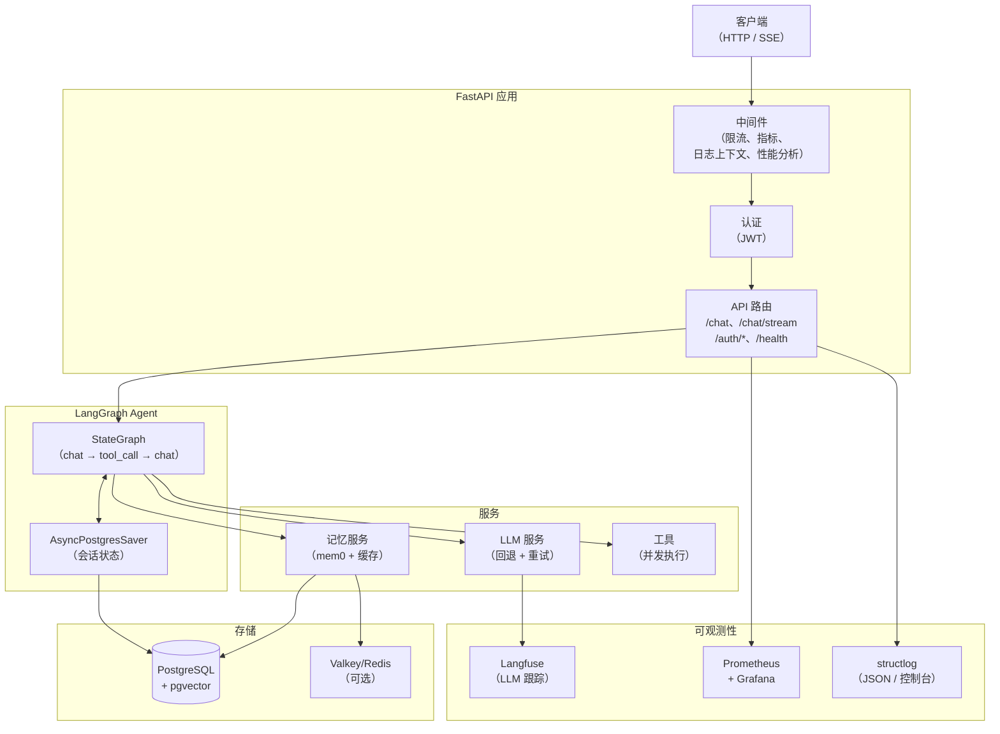
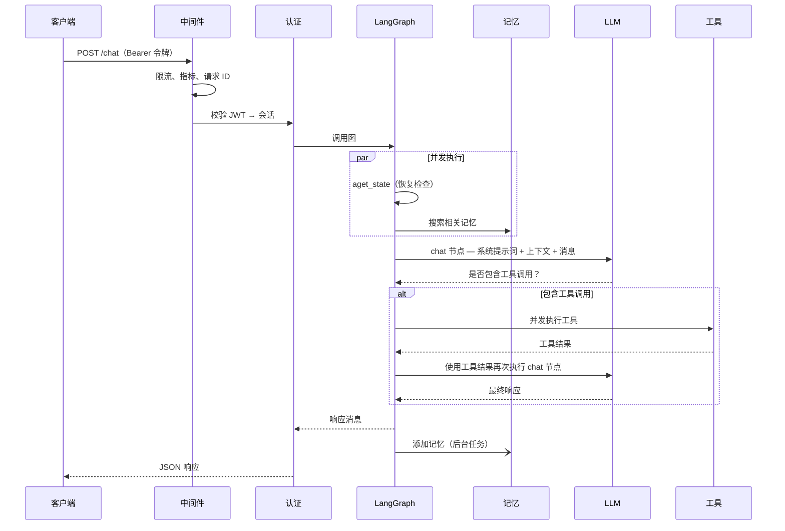
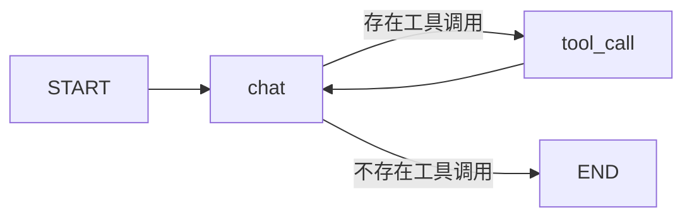

# 系统架构

## 系统概览

## 请求生命周期

## Agent 图

Agent 是由两个节点组成的 `StateGraph`：

- **`chat` 节点**：构建系统提示词、调用 LLM，并返回将流程路由到 `tool_call` 或 `END` 的 `Command`
- **`tool_call` 节点**：并发执行全部工具调用，并将结果传回 `chat`
- **检查点保存器**：`AsyncPostgresSaver` 按 `thread_id`（会话）持久化完整的 `GraphState`，支持中断恢复和多轮记忆

## 关键设计决策

**记忆搜索和状态检查并发执行.** 每次未恢复的请求都会通过 `asyncio.gather` 并行执行 `aget_state`（检查是否存在中断）和 `memory.search`（获取相关记忆），每次请求可节省 200–500 毫秒.

**工具调用并发执行.** 当 LLM 在一次响应中返回多个工具调用时，所有工具都会通过 `asyncio.gather` 并行执行.

**系统提示词在模块加载时缓存.** `system.md` 在启动时只读取一次.每次请求只需使用用户名、当前日期时间和检索到的记忆执行 `.format()`，不会产生文件 I/O.

**LLM 回退受时间限制.** 整个回退循环（重试次数 × 模型数量）都通过 `asyncio.wait_for(timeout=LLM_TOTAL_TIMEOUT)` 包装，避免无限等待.

**用户名通过会话传递，而不是每次请求查询数据库.** 创建会话时将用户显示名称复制到 `Session.username`.聊天请求直接从已经加载的会话对象读取用户名，不产生额外查询.

**会话标题生成不增加主请求延迟.** 未命名会话收到第一条消息时，API 会先使用占位名称原子占用会话（占位名称是用户消息的截断版本），然后启动后台 `asyncio.Task`，使用结构化输出调用快速 nano 模型.主聊天响应会立即返回，标题生成在后台并行执行.Postgres 中的原子 `UPDATE … WHERE name = ''` 确保并发请求下只有一个 Worker 能成功占用会话.

## 组件职责

| 组件 | 文件 | 职责 |
|---|---|---|
| LangGraph Agent | `app/core/langgraph/graph.py` | 编排会话处理循环 |
| LLM 服务 | `app/services/llm/` | 模型注册、重试、循环回退和结构化输出 |
| 记忆服务 | `app/services/memory.py` | mem0 语义记忆和缓存 |
| 会话命名 | `app/services/session_naming.py` | 为新会话后台生成 LLM 标题 |
| 数据库服务 | `app/services/database.py` | 用户和会话的 CRUD 操作 |
| 缓存服务 | `app/core/cache.py` | Valkey/Redis 及内存回退实现 |
| 中间件 | `app/core/middleware.py` | 指标、日志上下文和性能分析 |
| 认证 | `app/api/v1/auth.py` | JWT 创建和会话管理 |
