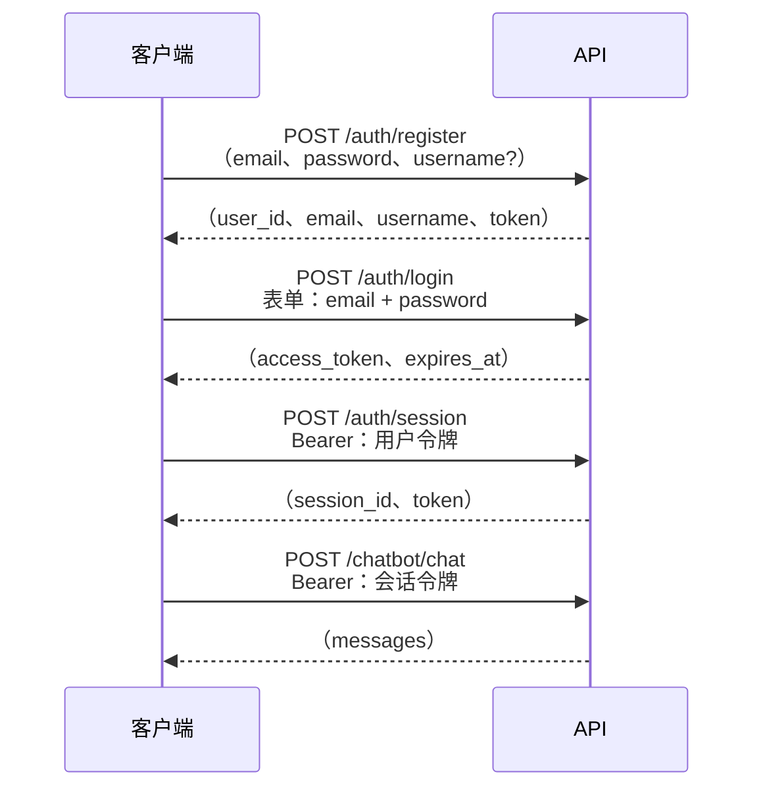

# 认证

## 流程



API 使用**两种令牌作用域**：

- **用户令牌**：在注册或登录时签发，用于标识用户，可用于创建和列出会话.
- **会话令牌**：为每个会话单独签发.所有聊天接口都需要该令牌，并且只对单个 `session_id` 有效.

两种令牌都是使用 HS256 签名的 JWT，过期时间可通过 `JWT_ACCESS_TOKEN_EXPIRE_DAYS` 配置.

---

## 接口

### `POST /api/v1/auth/register`

创建新账户.

```json
{
  "email": "you@example.com",
  "password": "Secret123!",  // pragma: allowlist secret
  "username": "you"
}
```

密码要求：至少 8 个字符，并且包含大写字母、小写字母、数字和特殊字符.

`username` 是可选的.提供后，它会传递给 Agent 的系统提示词，使 LLM 知道用户的名称.

---

### `POST /api/v1/auth/login`

使用认证信息换取用户令牌.该接口使用 OAuth2 密码授权的表单字段.

```bash
curl -X POST /api/v1/auth/login \
  -F "email=you@example.com" \
  -F "password=Secret123!" \
  -F "grant_type=password"
```

返回 `access_token` 和 `expires_at`.

---

### `POST /api/v1/auth/session`

创建新的聊天会话.需要有效的用户令牌.

```bash
curl -X POST /api/v1/auth/session \
  -H "Authorization: Bearer <user token>"
```

返回 `session_id` 和作用域为当前会话的 `token`.后续聊天请求都使用该会话令牌.

---

### `PATCH /api/v1/auth/session/{session_id}/name`

重命名会话.

```bash
curl -X PATCH /api/v1/auth/session/{session_id}/name \
  -H "Authorization: Bearer <session token>" \
  -F "name=My research session"
```

---

### `DELETE /api/v1/auth/session/{session_id}`

删除会话及其聊天历史.

---

### `GET /api/v1/auth/sessions`

列出当前认证用户的全部会话.需要用户令牌.

---

## 安全说明

- 密码在存储前会使用 bcrypt 哈希，系统不会持久化明文密码.
- JWT 包含用于保证令牌唯一性的 `jti`（JWT ID）声明.
- 所有字符串输入在使用前都会进行清理.
- 注册接口（每小时 10 次）和登录接口（每分钟 20 次）受到限流保护，可降低暴力破解风险.
- 生产环境请设置长度足够长的随机 `JWT_SECRET_KEY`，至少 32 个字符.
