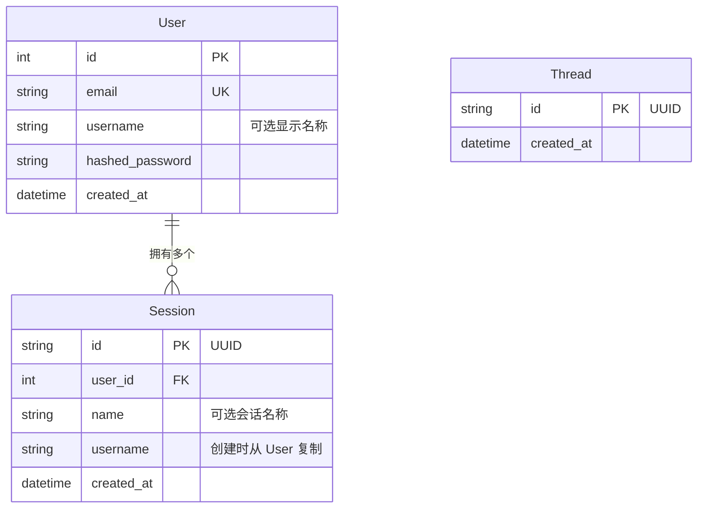

# 数据库与迁移

## Schema



**User**：每个账户对应一个用户.邮箱唯一.`username` 是可选的，用于个性化系统提示词.

**Session**：每个会话对应一次对话.一个用户可以拥有多个会话.创建会话时，`username` 会从 `User` 反规范化复制过来，因此聊天请求无需额外查询数据库.会话 JWT 对所有聊天请求进行作用域限制.

**Thread**：对应 LangGraph 的 `AsyncPostgresSaver` 检查点线程，用于跟踪应用上下文中存在的线程.

LangGraph 检查点保存器还会创建自己的表（`checkpoints`、`checkpoint_blobs`、`checkpoint_writes`），这些表由 LangGraph 自己管理，不由 Alembic 管理.

pgvector 会创建由 mem0 管理的 `longterm_memory` 集合表，该表同样不由 Alembic 管理.

---

## 使用 Alembic 迁移

所有 Schema 变更都通过 Alembic 管理.应用启动时不再调用 `create_all()`，Schema 由 Alembic 统一管理.

### 初始设置（全新数据库）

```bash
make migrate              # 将所有迁移应用到数据库
```

### 模型变更后创建迁移

```bash
# 1. 编辑 SQLModel 模型（app/models/）
# 2. 生成迁移
make migration MSG="add phone number to user"

# 3. 检查 alembic/versions/ 中生成的文件
# 4. 应用迁移
make migrate
```

### 其他命令

```bash
make migrate-downgrade    # 回滚最近一次迁移
make migrate-history      # 查看完整迁移历史
```

Alembic 通过 `app/core/config.py` 从 `.env` 文件读取数据库凭据.执行迁移前请确保 `APP_ENV` 设置正确.

### 自动生成的工作原理

`env.py` 会导入所有 SQLModel 模型以注册其元数据，然后调用 `alembic revision --autogenerate`.Alembic 将当前数据库 Schema 与模型进行比较，并生成升级/降级函数.

LangGraph 检查点保存器、mem0 和 pgvector 的外部表通过 `alembic/env.py` 中的 `include_object` 排除，因此 Alembic 永远不会修改这些表.

### 添加新模型

1. 创建 `app/models/your_model.py`
2. 在 `alembic/env.py` 中与其他模型一起导入该模型
3. 执行 `make migration MSG="add your_model table"`

---

## 为全新数据库添加 pgvector

运行迁移前必须启用 pgvector：

```sql
CREATE EXTENSION IF NOT EXISTS vector;
```

使用 Docker（`make docker-up`）时，`db` 服务会自动处理此步骤.对于外部数据库（例如 Supabase），请通过控制台或 SQL 编辑器启用扩展.
