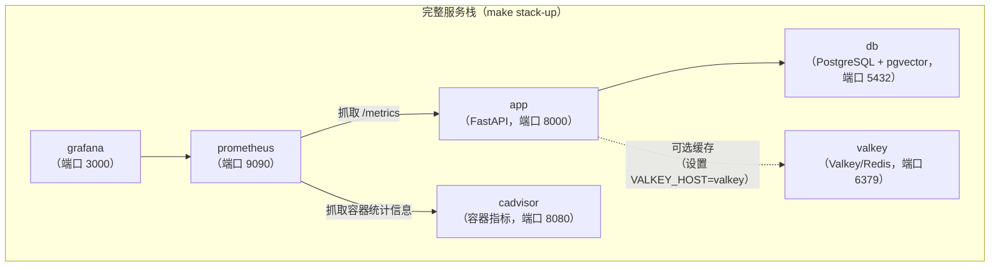

# Docker

## 服务



Valkey 始终会启动，但只有在 `.env` 文件中设置 `VALKEY_HOST=valkey` 时应用才会使用它.未设置时，应用会回退到内存缓存.

## 命令

### 仅启动 API 和数据库（开发环境最常用）

```bash
make docker-up ENV=development     # 启动
make docker-down ENV=development   # 停止
make docker-logs ENV=development   # 持续查看日志
```

### 完整服务栈（包含 Prometheus 和 Grafana）

```bash
make stack-up ENV=development      # 启动全部服务
make stack-down ENV=development    # 停止全部服务
make stack-logs ENV=development    # 持续查看全部服务日志
```

### 构建自定义镜像

```bash
make docker-build ENV=production
```

该命令会执行 `scripts/build-docker.sh`，为指定环境构建并标记镜像.

## 在 Docker 中运行迁移

执行 `make docker-up` 后，针对容器中的数据库运行迁移：

```bash
make migrate ENV=development
```

该命令会加载正确的 `.env` 文件，并在本地执行 `alembic upgrade head`，连接容器中的 PostgreSQL.

## 环境文件

每个环境都需要一个 `.env.<env>` 文件：

```bash
cp .env.example .env.development
cp .env.example .env.staging
cp .env.example .env.production
```

`docker-up` 和 `stack-up` 命令会通过 `--env-file` 将环境文件传递给 Docker Compose.请确保 Docker 环境文件中的 `POSTGRES_HOST=db`（不要设置为 `localhost`），因为 Compose 网络中的服务名称是 `db`.

## Grafana

执行 `make stack-up` 后，可通过 [http://localhost:3000](http://localhost:3000) 访问 Grafana.

默认凭据：`admin` / `admin`

`grafana/` 中已预配置以下仪表盘：

- API 性能（请求速率、延迟、错误率）
- 限流统计
- 数据库连接池健康状态
- 系统资源使用情况
