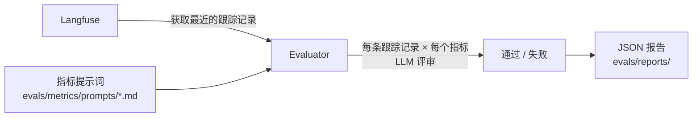

# 评估

此模板包含一个基于指标的评估框架：从 Langfuse 获取跟踪记录，使用 LLM 评审器进行评分，并生成 JSON 报告.

## 运行评估

```bash
make eval                        # 交互模式：提示输入配置
make eval-quick                  # 使用默认配置运行，不进行交互
make eval-no-report              # 运行评估，但跳过报告生成
make eval ENV=production         # 针对生产环境的跟踪记录运行
```

## 工作原理



1. **获取跟踪记录**：从 Langfuse 拉取最近的 LLM 跟踪记录（通过 `LANGFUSE_*` 环境变量配置）.
2. **评分**：针对每条跟踪记录和每个指标组合，由 LLM 评审器评估输出并返回通过/失败结果.
3. **生成报告**：将包含汇总统计和每条跟踪记录结果的 JSON 报告保存到 `evals/reports/`.

## 内置指标

| 指标 | 检查内容 |
| --- | --- |
| `helpfulness` | 响应是否真正帮助了用户？ |
| `conciseness` | 响应是否足够简洁？ |
| `hallucination` | 响应是否包含虚构事实？ |
| `relevancy` | 响应是否与主题相关？ |
| `toxicity` | 响应是否包含有害内容？ |

## 添加自定义指标

1. 在 `evals/metrics/prompts/` 中创建 Markdown 文件：

```markdown
# 我的指标

评估助手响应是否……

## 评分

如果……则返回 "pass"；如果……则返回 "fail".
```

2. 评估器会自动发现并应用该目录中的所有 `.md` 文件.

## 报告格式

报告保存到 `evals/reports/evaluation_report_YYYYMMDD_HHMMSS.json`：

```json
{
  "summary": {
    "total_traces": 50,
    "success_rate": 0.92,
    "duration_seconds": 34.2
  },
  "metrics": {
    "helpfulness": {"pass": 48, "fail": 2, "rate": 0.96},
    "hallucination": {"pass": 45, "fail": 5, "rate": 0.90}
  },
  "traces": [...]
}
```

## 评估 LLM 配置

评估器使用独立的 LLM 配置，因此可以使用更便宜的模型进行评审：

```bash
EVALUATION_LLM=gpt-5
EVALUATION_API_KEY=...   # 未设置时默认使用 OPENAI_API_KEY
```
