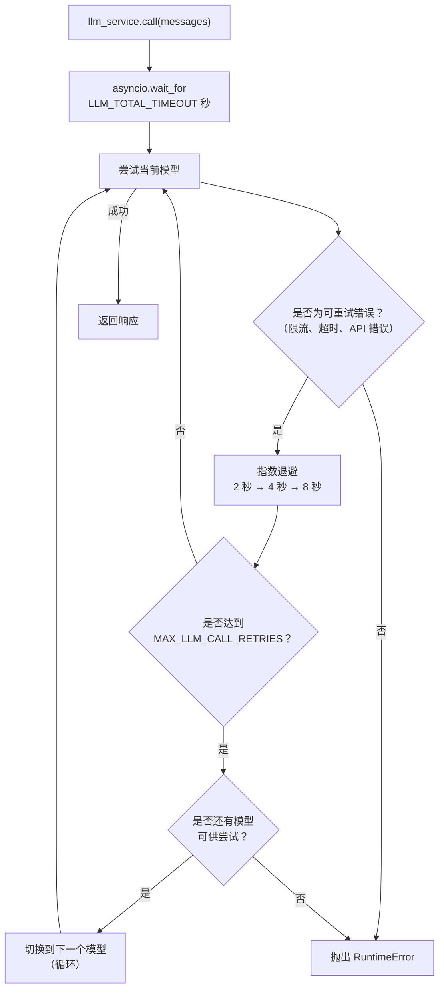

# LLM 服务

## 概览

LLM 服务（`app/services/llm/`）负责处理所有语言模型调用，提供自动重试、循环模型回退和总超时控制.Agent 代码只需调用 `llm_service.call(messages)`，其他逻辑由服务负责.

该模块拆分为两个文件：

- `app/services/llm/registry.py`：`LLMRegistry`，定义可用模型
- `app/services/llm/service.py`：`LLMService`，负责调用逻辑、重试、回退和结构化输出

## 模型注册表

模型按照优先级顺序定义在 `LLMRegistry.LLMS` 中：

| 名称 | 模型 | 说明 |
| --- | --- | --- |
| `gpt-5-mini` | gpt-5-mini | 默认模型，低推理强度 |
| `gpt-5.4` | gpt-5 | 中等推理强度 |
| `gpt-5.4-nano` | gpt-5.4-nano | 响应快速，低推理强度 |
| `gpt-5` | gpt-5 | 完整模型，针对生产环境调优的采样配置 |

在 `.env` 中设置 `DEFAULT_LLM_MODEL` 选择初始模型.

如需添加或修改模型，请编辑 `app/services/llm/registry.py` 中的 `LLMRegistry.LLMS`.

## 重试和回退行为



**重试配置**（每个模型独立）：

- 最大尝试次数：`MAX_LLM_CALL_RETRIES`（默认值：3）
- 等待策略：指数退避，最小 2 秒，最大 10 秒
- 重试错误：`RateLimitError`、`APITimeoutError`、`APIError`

**总超时：** `LLM_TOTAL_TIMEOUT` 秒（默认值：60 秒）限制整个循环的最大耗时.没有该限制时，最坏情况耗时为“重试次数 × 模型数量 × 最大等待时间”，可能超过 2 分钟.

**回退顺序：** 按 `LLMRegistry.LLMS` 的顺序循环回退.尝试最后一个模型后会回到第一个模型，并在完成一轮循环后停止.

## 工具

应用启动时会将工具绑定到 LLM：

```python
llm_service.bind_tools(tools)
```

回退过程中切换模型时，工具会自动重新绑定到新模型.

## 结构化输出

将 Pydantic 模型作为 `response_format` 传入，可以获得经过校验的实例，而不是原始 `BaseMessage`：

```python
from app.schemas.my_schema import MySchema

result: MySchema = await llm_service.call(
    messages,
    model_name="gpt-5.4-nano",   # 可选，省略时使用当前默认模型
    response_format=MySchema,
    temperature=0.2,
)
```

服务会在解析出的模型上调用 `.with_structured_output(schema)`，并在每次回退尝试时重新包装，因此重试和模型切换都能透明工作.

## 添加新模型

```python
# app/services/llm/registry.py — LLMRegistry.LLMS
{
    "name": "gpt-5.4",
    "llm": ChatOpenAI(
        model="gpt-5.4",
        api_key=settings.OPENAI_API_KEY,
        max_tokens=settings.MAX_TOKENS,
    ),
},
```

可以将模型添加到列表中的任意位置，回退顺序遵循列表顺序.
