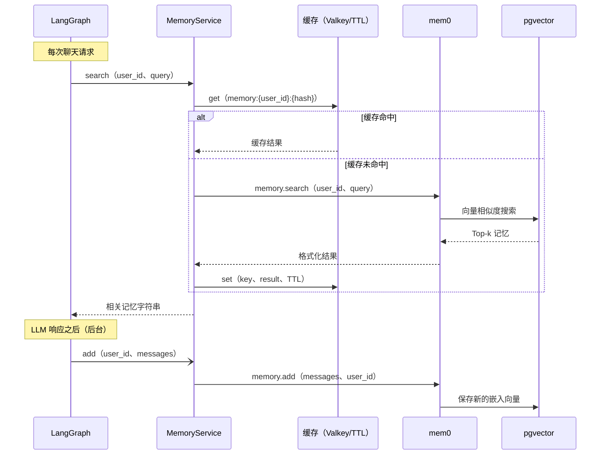

# 记忆

## 概览

此模板包含由 [mem0](https://github.com/mem0ai/mem0) 和 pgvector 驱动的长期记忆系统.系统会从对话中提取记忆，将其保存为向量嵌入，并在每次请求中进行语义检索，为 Agent 提供历史会话上下文.

## 工作原理

## 缓存层

记忆搜索结果会被缓存，避免在同一 TTL 窗口内针对相似问题重复查询 pgvector.

- **使用 Valkey/Redis：** 缓存在多个应用实例之间共享.在 `.env` 中设置 `VALKEY_HOST`.
- **不使用 Valkey：** 回退到内存 `TTLCache`，适合单实例运行.

缓存键：`memory:{user_id}:{sha256(query)[:16]}`

TTL：`CACHE_TTL_SECONDS`（默认值：60 秒）

只缓存成功且非空的结果，永远不会缓存错误.

## 记忆更新

LLM 生成响应后，系统通过 `asyncio.create_task` 在**后台**更新记忆.这意味着：

- 响应会立即返回，无需等待 mem0 完成
- 记忆更新不会阻塞或拖慢聊天响应

## 配置

| 变量 | 默认值 | 说明 |
| --- | --- | --- |
| `LONG_TERM_MEMORY_COLLECTION_NAME` | `longterm_memory` | pgvector 集合名称 |
| `LONG_TERM_MEMORY_MODEL` | `gpt-5-nano` | mem0 用于提取和处理记忆的 LLM |
| `LONG_TERM_MEMORY_EMBEDDER_MODEL` | `text-embedding-3-small` | 用于语义搜索的嵌入模型 |
| `CACHE_TTL_SECONDS` | `60` | 记忆搜索缓存 TTL |

## 启动预热

应用生命周期启动阶段会调用 `memory_service.initialize()`.该调用会建立 pgvector 连接池并执行 mem0 Schema 检查，避免首次用户请求承担约 130 毫秒的冷启动开销.

## 按用户隔离

每个用户的记忆都使用 `user_id` 作为命名空间独立保存和搜索，用户无法访问其他用户的记忆.
