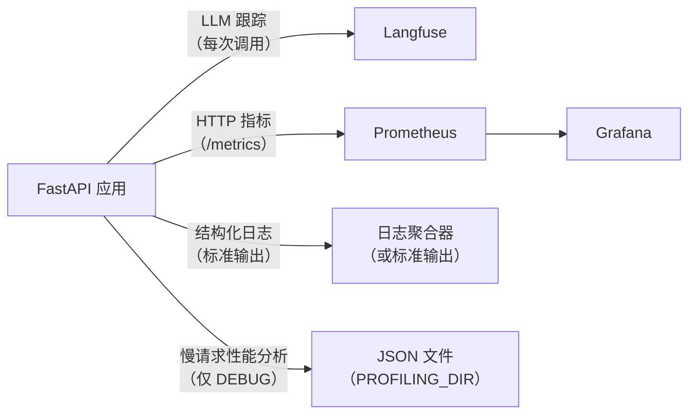

# 可观测性

## 概览



---

## Langfuse — LLM 跟踪

每次 LLM 调用都会通过 LangChain `CallbackHandler` 进行跟踪.跟踪记录包括：

- 输入消息和输出
- 令牌使用量和费用
- 每次调用和每个会话的延迟
- 模型名称、temperature 和其他参数

**配置：**

```bash
LANGFUSE_TRACING_ENABLED=true
LANGFUSE_PUBLIC_KEY=pk-...
LANGFUSE_SECRET_KEY=sk-...
LANGFUSE_HOST=https://cloud.langfuse.com   # 或你的自托管地址
```

**本地开发时禁用：**

```bash
LANGFUSE_TRACING_ENABLED=false
```

跟踪记录同时作为[评估框架](evaluation.md)的数据源.

---

## 结构化日志

所有日志都使用 [structlog](https://www.structlog.org/) 以统一格式输出：

- **开发环境：** 彩色控制台输出
- **生产环境：** JSON 格式（可通过管道传递给日志聚合器）

每条日志在可用时都会自动携带 `request_id`、`session_id` 和 `user_id`，这些字段由 `LoggingContextMiddleware` 绑定.

### 日志格式约定

```python
# 正确示例
logger.info("chat_request_received", session_id=session.id, message_count=5)

# 禁止示例
logger.info(f"chat request received for {session.id}")  # 不使用 f-string
logger.error("something failed", error=str(e))          # 异常中使用 logger.exception
```

规则：

- 事件名称使用 `lowercase_with_underscores` 格式
- 变量作为关键字参数传入，不能插入事件字符串
- 在 `except` 代码块中使用 `logger.exception()`（不要使用 `.error()`），以保留完整堆栈信息

### 按环境划分的日志级别

| 环境 | 级别 |
| --- | --- |
| development | DEBUG |
| staging | INFO |
| production | WARNING |

---

## Prometheus 指标

指标通过 `GET /metrics` 暴露，并由 Prometheus 抓取.

| 指标 | 类型 | 说明 |
| --- | --- | --- |
| `http_requests_total` | Counter | 按方法、接口和状态统计请求数量 |
| `http_request_duration_seconds` | Histogram | 按方法和接口统计请求延迟 |
| `llm_inference_duration_seconds` | Histogram | 按模型统计 LLM 调用延迟 |
| `llm_stream_duration_seconds` | Histogram | 按模型统计流式调用延迟 |
| `db_connections` | Gauge | 活跃数据库连接数 |

Grafana 仪表盘已在 `grafana/` 中预配置.执行 `make stack-up ENV=development` 后，可通过 [http://localhost:3000](http://localhost:3000) 访问，凭据为 `admin/admin`.

---

## 请求性能分析（仅调试模式）

当 `DEBUG=true` 时，`ProfilingMiddleware` 会使用 [pyinstrument](https://github.com/joerick/pyinstrument) 分析每个请求.当请求耗时超过 `PROFILING_THRESHOLD_SECONDS` 时，会将 JSON 报告保存到 `PROFILING_DIR`.

每个报告文件命名为 `{request_id}.json`，内容包括：

```json
{
  "request_id": "...",
  "endpoint": "POST /api/v1/chatbot/chat",
  "wall_time_ms": 1842,
  "cpu_time_ms": 145,
  "io_wait_ms": 1697,
  "memory_peak_kb": 4820,
  "top_memory_allocators": [...],
  "call_tree": {...}
}
```

设置 `PROFILING_THRESHOLD_SECONDS=0` 可分析每个请求.

文件名中的 `request_id` 与响应头 `X-Request-ID` 一致，因此可以将性能分析报告与具体日志关联起来.

---

## 请求 ID 传递

每个请求都会通过 [`asgi-correlation-id`](https://github.com/snok/asgi-correlation-id) 获得唯一的 `X-Request-ID` 请求头.该 ID：

- 会在响应头中返回
- 会绑定到该请求的每条日志
- 会作为性能分析报告的文件名

可以使用响应中的 `X-Request-ID` 搜索日志、查找性能分析报告，并查询该请求对应的 Langfuse 跟踪记录.
